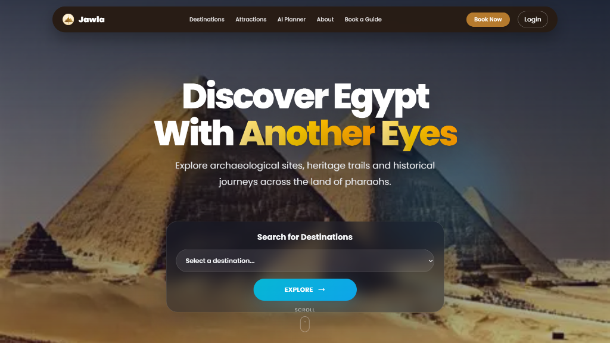
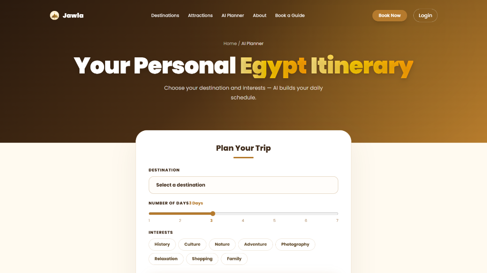
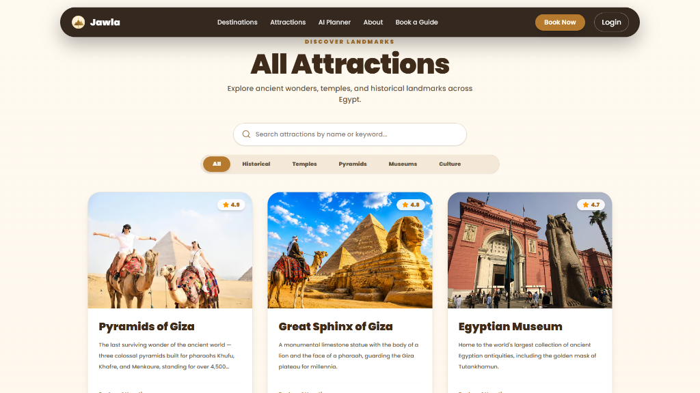
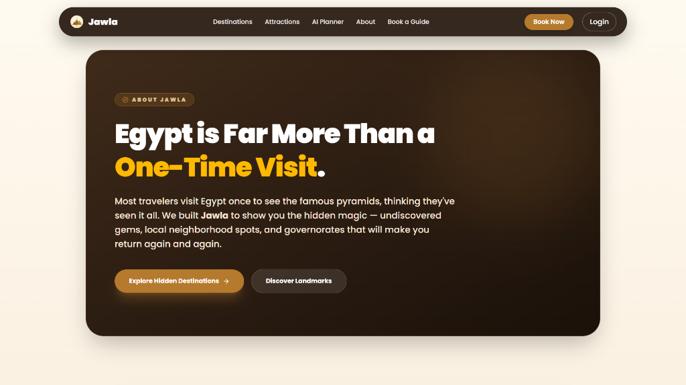
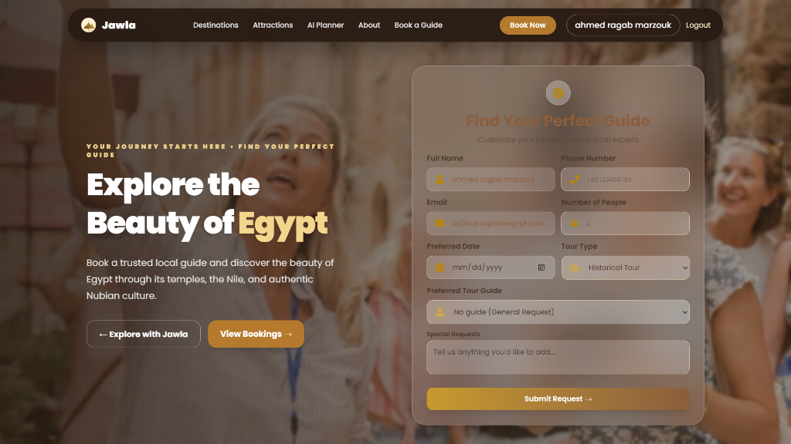
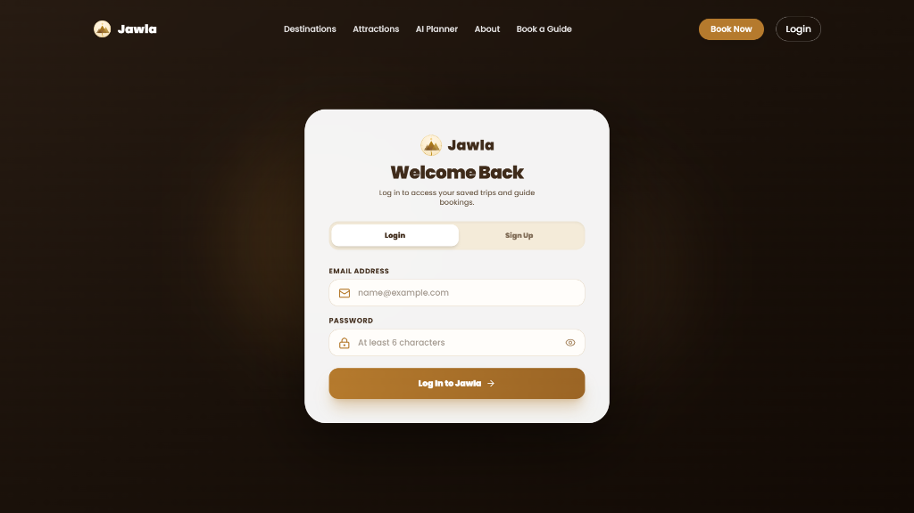
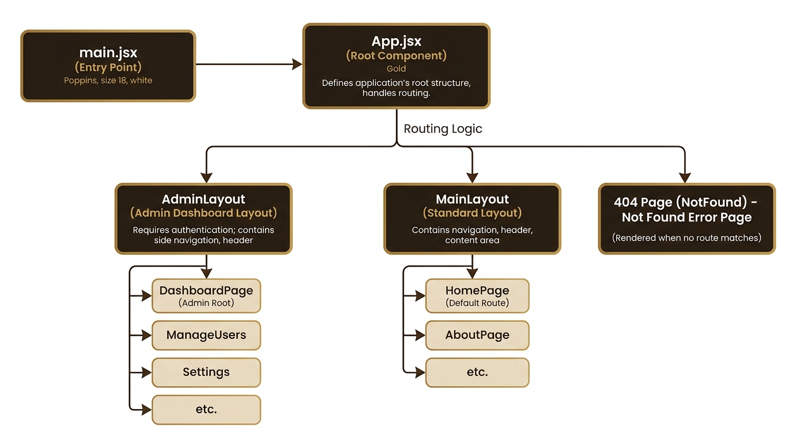
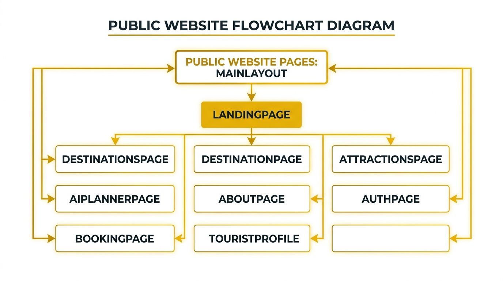
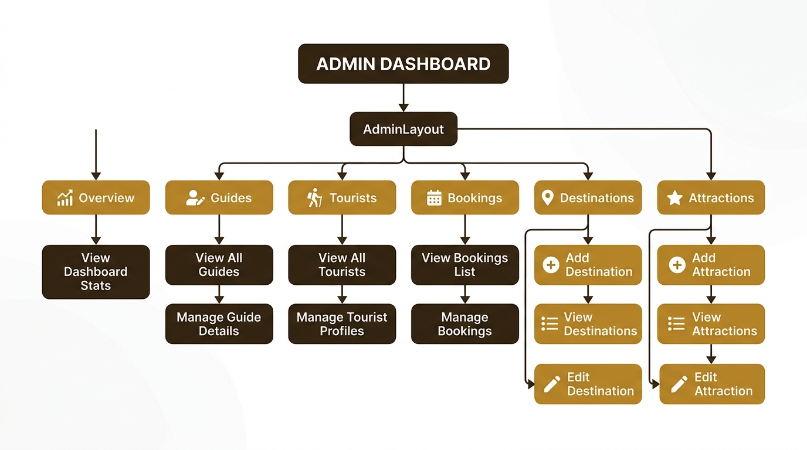
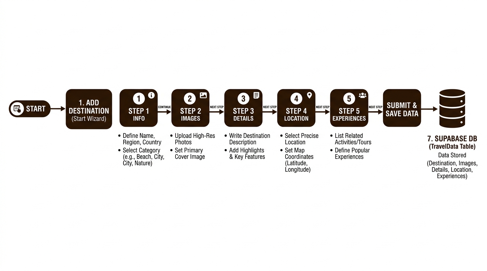

<p align="center">
  
</p>

<h1 align="center">Jawla (جولة)</h1>

<h3 align="center">
Redefining Tourism in Egypt — AI Trip Planning & Unexplored Hidden Gems
</h3>

<p align="center">
Hidden Gems • AI Trip Planner • Certified Tour Guides • Multi-Step Wizards • Responsive Luxury UI
</p>

<div align="center">


</div>

---

## 📑 Table of Contents

- [About Jawla](#about-jawla)
- [Core Features](#core-features)
- [Tech Stack](#tech-stack)
- [Architecture](#architecture)
- [Project Structure](#project-structure)
- [Screenshots](#screenshots)
- [Database Schema & API Overview](#database-schema--api-overview)
- [Getting Started](#getting-started)
- [Future Roadmap](#future-roadmap)
- [Meet the Team](#meet-the-team)

---

<a name="about-jawla"></a>

## 📖 About Jawla

**Jawla (جولة)** is an Egyptian tourism platform designed to transform how travelers experience Egypt.

Most tourists visit Egypt once to see standard famous landmarks like the Pyramids, assuming they have seen the entire country. **Jawla** breaks this one-time visit cycle by revealing **unexplored hidden gems**, non-heritage local spots, and authentic cultural trails across all 27 Egyptian governorates.

By combining **Google Gemini AI trip planning**, certified local Egyptologist tour guides, and modular multi-step management tools, Jawla turns single visits into lifelong journeys of discovery.

---

<a name="core-features"></a>

## ✨ Core Features

### 🤖 AI Trip Planner (Google Gemini)

Generate customized daily itineraries based on:

- Destination City
- Number of Days (1-7 Days)
- Travel Interests (History, Culture, Nature, Photography, Food, Shopping)
- Day-by-day hourly schedule with print & PDF download capabilities.

### 💎 Hidden Gems & Places Explorer

Discover Egypt beyond standard tourist traps:

- Historical Monuments & Pyramids
- Museums & Cultural Landmarks
- Non-Heritage Local Gems & Secret Neighborhood Spots
- Beaches, Safaris, and Natural Preserves across all 27 governorates
- Rich filtering by category, search query, and star ratings.

### 🧭 Verified Tour Guide Marketplace

Connect directly with certified Egyptologists:

- Guide Verification & Approval Workflow
- Acceptance & Recline Booking System
- Custom Greeting Notes for Tourists
- Experience & Specialty Badges

### 👑 Admin Control Center & Modular Wizards

Comprehensive system management:

- **5-Step Destination Wizard** (Info, Media, Description/History, Location Coordinates, Dynamic JSONB Experiences).
- **4-Step Attraction Wizard** (Identity, Media, Description, Details).
- Interactive tables for Tourists, Tour Guides, and Bookings.

### 🛡 Role-Based Access Control (RBAC) & Protected Routes

Secured navigation with dedicated dashboards for:

- **Tourist Profile**: View booked trips & saved AI itineraries.
- **Tour Guide Dashboard**: Review incoming trip requests and status.
- **Admin Dashboard**: System control center.

### 🎨 Responsive Luxury UI & Skeleton Loading UX

- Egyptian Warm Palette (Luxury Brown `#3f2b1a`, Gold `#b57a2d`, Soft Sand `#fdfaf6`).
- GSAP ScrollTrigger entrance animations.
- Shimmer Skeleton UI placeholders (`CardSkeleton`, `TableSkeleton`, `FormSkeleton`).
- React Toastify notifications.
- **Form Management & Validation**: Integrated **React Hook Form** with **Zod** for high-performance, schema-based form validation across all system modules (Booking, Auth, and Admin Wizards).
- 100% mobile responsive touch-scrollable navigation.

---

<a name="tech-stack"></a>

## 🚀 Tech Stack

**Frontend**

- React 18 (Vite)
- Tailwind CSS v4
- React Router v7
- **React Hook Form** (High-performance form management)
- **Zod** (Schema-based validation)
- Lucide React Icons
- GSAP (GreenSock Animation Platform & ScrollTrigger)
- React Toastify

**Backend & Database**

- Supabase Client (PostgreSQL)
- Supabase Authentication & Realtime Storage
- Supabase JSONB Data Fields

**AI Integration**

- Google Gemini API (`@google/generative-ai` / `useAIPlanner`)

---

<a name="architecture"></a>

## 🏗 Architecture

```text
                   ┌────────────────────────────┐
                   │       React Frontend       │
                   │    (Vite + Tailwind CSS)   │
                   └──────────────┬─────────────┘
                                  │
                  ┌───────────────┴───────────────┐
                  │                               │
       Supabase API Client                 Google Gemini API
                  │                               │
       ┌──────────▼──────────┐          ┌─────────▼──────────┐
       │ Supabase PostgreSQL │          │  AI Trip Generator │
       │  (Auth, DB, Storage)│          └────────────────────┘
       └─────────────────────┘
```

---

<a name="project-structure"></a>

## 📂 Project Structure

```text
Jawla
│
├── public
│   ├── favicon.svg
│   └── assets
│
├── src
│   ├── app
│   │   ├── App.jsx
│   │   └── ScrollToTopButton.jsx
│   │
│   ├── dashboards
│   │   ├── admin
│   │   │   ├── AdminDashboard.jsx
│   │   │   ├── components (AdminStatsGrid, Tables)
│   │   │   ├── Attraction (Addattraction, EditAttraction, ViewAttractions, attractionSteps)
│   │   │   └── Destination (AddDestination, EditDestination, ViewDestinations, destinationSteps)
│   │   │
│   │   ├── tourguide
│   │   │   ├── TourGuideDashboard.jsx
│   │   │   └── components (GuideBookingCard, TourGuideProfileCard)
│   │   │
│   │   └── tourist
│   │       ├── TouristDashboard.jsx
│   │       └── components (AITripsList, BookingCard, TouristProfileEditForm)
│   │
│   ├── features
│   │   ├── ai-planner (AIPlannerPage, gemini.js, geminiPrompt.js, aiTripsStorage.js)
│   │   ├── attractions (AttractionsPage, AttractionDetailsPage, AttractionCategoryTabs)
│   │   ├── auth (AuthContext, RequireRole, AuthPage, AuthFormFields)
│   │   ├── booking (BookingPage, BookingForm, BookingFormFields)
│   │   ├── destinations (HeroContent, InfoPanel, ExperienceSection, GuideSection)
│   │   └── landing (HeroSection, HeroSearchForm, PopularSection, FeatureSection)
│   │
│   ├── hooks (useSEO.js)
│   ├── layout (MainLayout.jsx, AdminLayout.jsx)
│   ├── pages (LandingPage, DestinationsPage, DestinationPage, AboutPage, NotFoundPage)
│   ├── shared (Navbar, Footer, Slider, Skeleton, PageLoader)
│   └── supabase.js
│
├── .env.example
├── package.json
├── vite.config.js
└── README.md
```

---

<a name="screenshots"></a>

## 📸 Showcase & Visuals

| Home Landing                                           | AI Trip Planner                                              |
| ------------------------------------------------------ | ------------------------------------------------------------ |
|  |  |

| Attractions Explorer                                          | About Jawla Vision                                      |
| ------------------------------------------------------------- | ------------------------------------------------------- |
|  |  |

| Guide Booking Marketplace                                 | Modern Login & Authentication                           |
| --------------------------------------------------------- | ------------------------------------------------------- |
|  |  |

### 📊 System Architecture & Data Flow

| App Architecture                                                     | Public Routes Flow                                                |
| -------------------------------------------------------------------- | ----------------------------------------------------------------- |
|  |  |

| Admin Dashboard Routes                                                     | Admin Wizards Flow                                                         |
| -------------------------------------------------------------------------- | -------------------------------------------------------------------------- |
|  |  |

---

<a name="database-schema--api-overview"></a>

## 📡 Database Schema & Supabase API Overview

### Primary Supabase Tables

#### 1. `destinations`

Stores Egypt's governorates and heritage cities.

```sql
id (text PRIMARY KEY), name, weatherLabel, heroImage, image, heroTitle,
description, history, latitude, longitude, experienceDescription,
experiences (jsonb array of experience objects)
```

#### 2. `attractions`

Stores specific landmarks and monuments.

```sql
id (uuid / text PRIMARY KEY), destinationId (foreign key), name, category,
image, description, duration (integer), bestTime, star (numeric)
```

#### 3. `tourGuides`

Stores registered and verified tour guides.

```sql
id (uuid PRIMARY KEY), email, name, status ('Pending approval' | 'Approved' | 'Rejected'),
languages, bio, phone
```

#### 4. `bookings`

Stores booking requests submitted by tourists.

```sql
id (uuid PRIMARY KEY), touristName, phone, guideId, destinationId,
date, status ('Pending' | 'Approved' | 'Rejected'), guideNote
```

#### 5. `ai_trips`

Stores itineraries generated by Google Gemini AI.

```sql
id (uuid PRIMARY KEY), userId, destination, days, interests, trip (jsonb), createdAt
```

---

<a name="getting-started"></a>

## 🛠 Getting Started

### Environment Variables

Create a `.env` file in the root directory with the following variables:

```env
VITE_SUPABASE_URL=your_supabase_project_url
VITE_SUPABASE_ANON_KEY=your_supabase_anon_key
VITE_GEMINI_API_KEY=your_google_gemini_api_key
```

### Installation & Execution

**1. Clone the repository**

```bash
git clone https://github.com/your-username/Jawla.git
cd Jawla
```

**2. Install dependencies**

```bash
npm install
```

**3. Run local development server**

```bash
npm run dev
```

**4. Build for production**

```bash
npm run build
```

---

<a name="future-roadmap"></a>

## 🚀 Future Roadmap

- [ ] Tour Guide Live Availability Toggle Switch (Online / Offline)
- [ ] Push Notifications System for Booking Status Updates
- [ ] Interactive Map Integration (Mapbox / Leaflet)
- [ ] Online Payment Gateway (Paymob / Stripe)
- [ ] Multi-Language Context (Arabic / English Instant Switch)
- [ ] Tourist Reviews & Star Ratings System for Guides

---

<a name="meet-the-team"></a>

## 👥 Meet the Team

- 👨‍💻 **Ahmed Ragab Marzouk**
- 👩‍💻 **Heba Alrawy Ahmed**
- 👩‍💻 **Emy Ayoub Atallah**
- 👩‍💻 **[Rodina Ahmed Gamal Eldin](https://github.com/RodinaAhmedd)**
- 👨‍💻 **Elsam Ali Mahrous**
- 👩‍💻 **Carol Akmal Fakhry**

---

### ⭐ Support & Acknowledgments

If you like **Jawla**, don't forget to give it a ⭐ on GitHub!

---

<p align="center">
  <h2 align="center">🇪🇬 Rediscover Egypt Beyond Boundaries with Jawla</h2>
  <p align="center">Built with ❤️ by Team Jawla (Depi React Team)</p>
</p>
